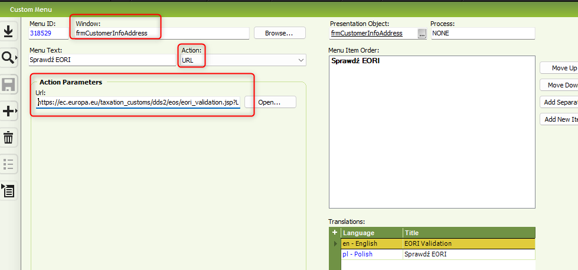

# 🚀 Quick IFS tip: Add EORI validation into Customer Address screen

Sometimes you need to check if your customer’s **EORI number** is valid (for customs or cross-border invoices).  
Instead of opening a browser and searching manually, you can add it directly into IFS as a **custom menu**.

---

## 🔧 How to set it up

1. Go to **IFS → Solution Manager → Custom Menus**.
2. Add a new menu item for window `frmCustomerInfoAddress`.
3. Set **Action = URL**.
4. Paste this link into *Action Parameters / URL*:

   ```text
   https://ec.europa.eu/taxation_customs/dds2/eos/eori_validation.jsp?Lang=en&&Expand=true&EoriNumb=&C_NR_EORI
