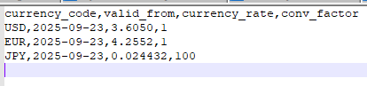
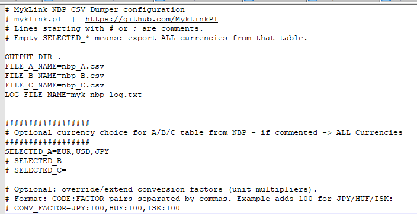

# MykLink NBP CSV Dumper

**myklink.pl** • https://github.com/MykLinkPl\
Author: **Przemysław Myk**

Fetches the latest NBP exchange rate tables (**A / B / C**) and saves
them as CSV files.

-   Config via `MykLinkNBP.conf` 
-   Per-table currency filters (empty = ALL)
-   Log with hard rotation to **1000 lines**

### Sample CSV output


------------------------------------------------------------------------

## Features

-   Exports three files: `nbp_A.csv`, `nbp_B.csv`, `nbp_C.csv`
-   CSV schema:\
    `currency_code,valid_from,currency_rate,conv_factor`
-   Table A/B → uses **mid**; table C → **(bid + ask) / 2**
-   Handles unit multipliers (e.g. `JPY`, `HUF`, `ISK` →
    `conv_factor=100`)
-   Output directory, file names, filters, and log name configurable

------------------------------------------------------------------------

## Requirements

-   Windows + .NET Framework **4.7.2** or **4.8**
-   Internet access to `api.nbp.pl`

------------------------------------------------------------------------

## Quick Start

1.  Build the console app (Visual Studio or MSBuild).

2.  Place `MykLinkNBP.conf` next to the executable (or let the app
    create it on first run).

3.  Run:

    ``` powershell
    MykLinkNbp.exe
    ```

    Optional: override output directory from CLI:

    ``` powershell
    MykLinkNbp.exe "D:\nbp_exports"
    ```
4.  Schedule exe app in scheduler
5.  Schedule migration job in IFS
   
Generated files in the output dir: - `nbp_A.csv`, `nbp_B.csv`,
`nbp_C.csv` - `myk_nbp_log.txt` (keeps last 1000 lines)

------------------------------------------------------------------------

## Configuration (`MykLinkNBP.conf`)

-   INI-like `key=value`
-   Comma-separated lists
-   Lines starting with `#` / `;` are comments

Example:

``` ini
# MykLink NBP CSV Dumper configuration
# myklink.pl  |  https://github.com/MykLinkPl
# Empty SELECTED_* = export ALL currencies from that table.

OUTPUT_DIR=.

FILE_A_NAME=nbp_A.csv
FILE_B_NAME=nbp_B.csv
FILE_C_NAME=nbp_C.csv

LOG_FILE_NAME=myk_nbp_log.txt

# Optional filters (comma-separated). Empty = ALL.
# SELECTED_A=EUR,USD
# SELECTED_B=
# SELECTED_C=

# Optional unit multipliers override (CODE:FACTOR pairs)
# Default already includes: JPY:100,HUF:100,ISK:100
# CONV_FACTOR=JPY:100,HUF:100,ISK:100
```

### Config file example


> If the file doesn't exist, the app will create it with sane defaults
> on first run.

------------------------------------------------------------------------

## Output format

Each CSV has the header:

    currency_code,valid_from,currency_rate,conv_factor

------------------------------------------------------------------------

## Logging

-   File name from config (`LOG_FILE_NAME`, default `myk_nbp_log.txt`)
-   Always trimmed to **last 1000 lines** after each write


------------------------------------------------------------------------

## License

Feel free to use :)
