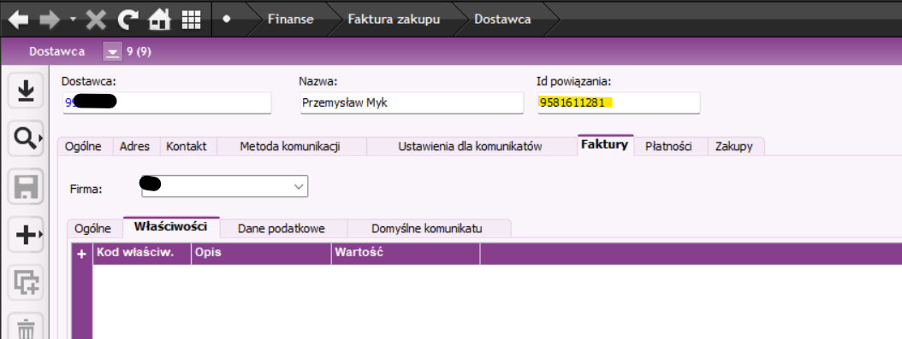
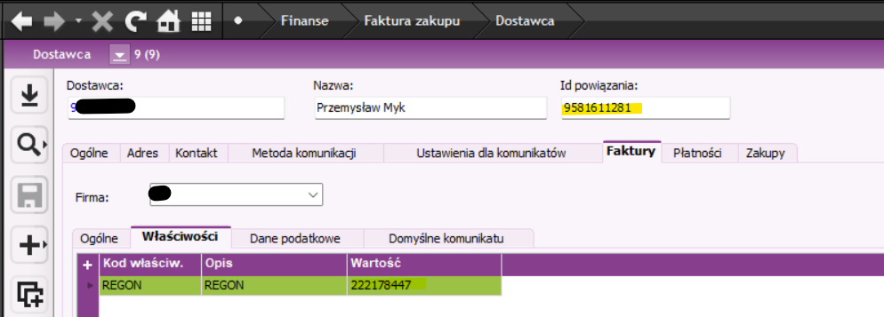

# IFS GUS REGON/KRS Sync


## Author
[MykLink \| Smart Connections \| Przemysław Myk](https://myklink.pl/)

Small helper for IFS Apps 8.

It reads distinct Polish NIPs from Oracle / IFS, checks them in GUS REGON BIR API, caches results locally, and writes missing REGON / KRS values back to IFS.


## What it does
Before:



After:




Flow:

1. read distinct NIPs from IFS ( Suppliers + Customers )
2. skip non-Polish / invalid values already filtered in SQL
3. check local cache first
4. if not in cache, call GUS BIR API
5. for found companies, write missing REGON / KRS into IFS
6. use the same GUS result for all matching companies / identities in IFS

## Main idea

One NIP is queried in GUS only once.

Then the same REGON / KRS is used for all matching IFS records, even if the same contractor exists in multiple companies.


## Files

- `Program.cs` – main app
- `MykLinkGusIfsSync.csproj` – project file
- `config.json.example` – config template
- `ServiceReference/Reference.cs` – generated GUS service reference


## GUS API key

Access to the REGON BIR API requires a user key.

The key is free and easy to obtain from the official GUS website.  
Instructions and registration form are available here:

https://api.stat.gov.pl/Home/RegonApi

The same key works for BIR 1 / 1.1 / 1.2 versions of the API.

After receiving the key, create `config.json` based on `config.json.example`.


## Config

Example:

```json
{
  "oracleConnectionString": "User Id=xxx;Password=xxx;Data Source=xxx;",
  "gusApiKey": "PUT_YOUR_GUS_KEY_HERE",
  "cacheFile": "gus-cache.json",
  "logFile": "gus-sync.log",
  "cacheTtlDays": 30,
  "saveCacheEvery": 20,
  "requestsPerSecond": 2,
  "requestsPerMinute": 100,
  "requestsPerHour": 5000
}
```

## License

Feel free to use :)
