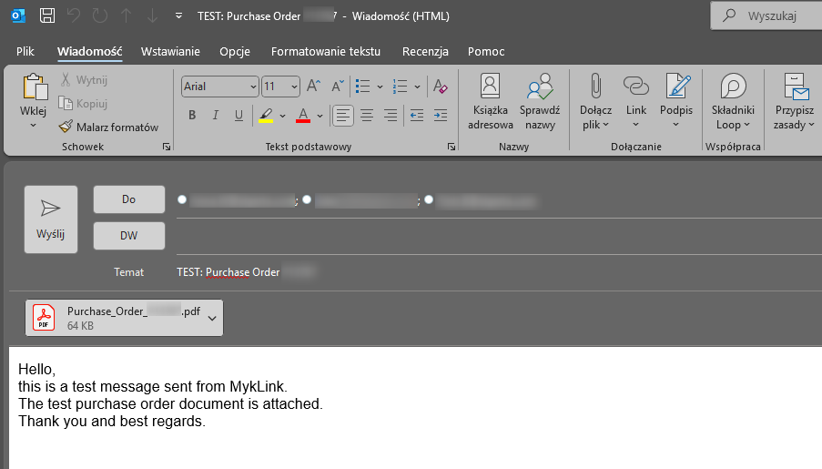

# MykLink_IFSPO_outlook_printer

Create a prefilled Outlook email with a **Purchase Order PDF** fetched from **IFS** using the **IFS Access Provider DLL**.  
Works with classic Outlook (COM) and **New Outlook** (via `.eml` fallback).


## How it works

1. Prompts for IFS credentials (via IFS login dialog).
2. Validates PO state with `Purchase_Order_Api.Get_Objstate__`.
3. Collects supplier email addresses from `COMM_METHOD` (no `LISTAGG`).
4. Generates PO PDF through IFS.
5. Opens a mail draft with the PDF attached and recipients prefilled.




---

## Requirements

- Windows
- .NET (Console App; add reference to **System.Windows.Forms**)
- IFS Access Provider assemblies available at runtime (same version as your IFS)

---

## Files in this repo

- `Program.cs` – the whole app (single file).
- `myklink_conf.json` – configuration (see below).
- `ifs_purchase_order.png`, `generate_1_login.png`, `generate_1_email.png` – screenshots.

---

## Build

Create a **Console Application** and add references to:
- `Ifs.Fnd.AccessProvider` (+ `Interactive`, `PLSQL`, `Data`)
- `System.Windows.Forms`
- `Newtonsoft.Json`

Put `Program.cs` and `myklink_conf.json` next to the executable (or in your project output).

---

## Run

```bash
MykLink_IFSPO_outlook_printer.exe <environment> <PO_number>
```

Examples:
```bash
MykLink_IFSPO_outlook_printer.exe demo AAAPLU01
MykLink_IFSPO_outlook_printer.exe prod  45001234
```

At start you’ll see the IFS login dialog. After success, the app creates a mail draft.

---

## Configuration (`myklink_conf.json`)

Place next to the executable. Example:

```json
{
  "defaultRecipient": "someone@example.com",

  "environments": {
    "demo": "http://ifs-server:59080",
    "test": "http://ifs-server:60080",
    "prod": "http://ifs-server:59080"
  },

  "allowedStates": ["Confirmed", "Released"],

  "supplierCommName": "ZZ",

  "mail": {
    "pl": {
      "subject": "TEST: Zamówienie zakupu {orderNo}",
      "body": "<html><head><meta charset='utf-8'></head><body style='font-family:Arial;font-size:11pt'>Dzień dobry,<br>to jest wiadomość testowa wysyłana z MykLink.<br>W załączeniu znajduje się testowy dokument zamówienia.<br>Dziękuję i pozdrawiam.</body></html>"
    },
    "en": {
      "subject": "TEST: Purchase Order {orderNo}",
      "body": "<html><head><meta charset='utf-8'></head><body style='font-family:Arial;font-size:11pt'>Hello,<br>this is a test message sent from MykLink.<br>The test purchase order document is attached.<br>Thank you and best regards.</body></html>"
    }
  }
}
```

### Keys

- `defaultRecipient` – fallback recipient if supplier has no email.
- `environments` – name → IFS Access Provider URL.
- `allowedStates` – list of allowed `Get_Objstate__` values (e.g., `Confirmed`, `Released`).
- `supplierCommName` – the **COMM_METHOD.NAME** used to pull supplier emails (e.g., `ZZ`, `ZZKOM`, `EMAIL`).
- `mail.pl / mail.en` – email templates; `{orderNo}` is replaced with the PO number.

---

## Outlook compatibility

- **Classic Outlook**: uses COM – recipients are added via `Recipients.Add`, attachment is added, the draft is shown.
- **New Outlook / no COM**: the app writes an **`.eml`** file and opens it via shell; `To:` is comma-separated and the body/attachment are MIME-encoded.
