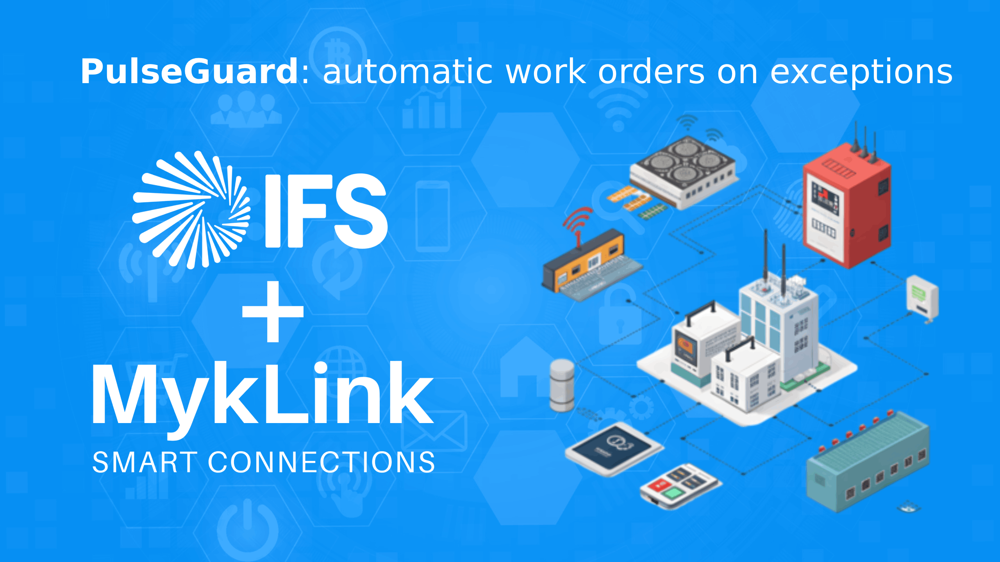

# PulseGuard — IoT ➜ IFS Work Orders

> Sensor control with automatic IFS work tickets when anything goes off-spec.  
> **PL:** Kontrola sensorów i automatyczne zgłoszenia w IFS, gdy coś jest poza normą.

```
[ IoT sensor ] ──> [ PulseGuard ] ──> [ IFS: FAULT_REPORT_API.NEW__ ]
        (oil level, vibration, temperature, …)
```


## What it does
- Polls simple IoT endpoints (HTTP GET).
- Evaluates **binary** (0/1) or **threshold** (UP/DOWN) rules.
- Uses a retry window to avoid flapping.
- **De-duplicates:** once a work order is created, no duplicates are sent until the sensor returns to normal.
- Creates IFS work requests via `IFSAPP.FAULT_REPORT_API.NEW__` (PL/SQL through IFS FND libraries).

---

## Build

- **Runtime:** Windows (.NET Framework **4.7.2** or 4.8), C# 7.3
- **Platform target:** x86 (if your IFS FND DLLs are x86)
- **References (copy from your IFS client install):**
  - `Ifs.Fnd.AccessProvider.dll`
  - `Ifs.Fnd.AccessProvider.Interactive.dll`
  - `Ifs.Fnd.AccessProvider.PLSQL.dll`
  - `Ifs.Fnd.Data.dll`
  - `System.Windows.Forms`

> The app supports **silent service login** if `service_user` & `service_password` are provided; otherwise it shows the IFS login dialog.

---

## Configuration

Create `myklink_iot_watcher.conf` next to the EXE.

```ini
retry_qty_then_alert = 5;
ifs_user = login;
ifs_password = pass;
ifs_url = http://ifsappserver:59080
reported_by = WORKER1
org_code = ADM
debug = false
pm_type = Separate Action
connection_type_db = EQUIPMENT
e_flag = DO


[devices]
# BINARY:    Name,ifs_object_id,contract,url,BINARY,normal_value,err_descr
Compressor1,COMPRESSOR1,CONT1,https://iot.myklink.pl/compressor1,BINARY,1,"URGENT! Oil level too low. Please refill"
OilTemp,COMPRESSOR1,CONT1,https://iot.myklink.pl/compressor1_temp1,THRESHOLD:UP,60.0,"{name}: temperature high = {value}"
```

### Notes
- `err_descr` supports `{name}` and `{value}` placeholders.
- For **binary** devices, `normal_value` must be `0` or `1`.
- For **threshold** devices, `THRESHOLD:UP` fires when `value > threshold`, `THRESHOLD:DOWN` when `value < threshold`.

---

## State file

The app creates/maintains `myklink_iot_states.csv`:

```csv
# ifs_object_id,last_value,retry_qty,alert_open
COMPRESSOR1,1,0,0
```

- `alert_open = 1` means a work order was already sent; it resets to `0` only after the reading returns to normal.

---

## How it decides to create a work order

1. Read sensor value.
2. Decide **normal vs abnormal**:
   - Binary: `current == normal_value`
   - Threshold UP/DOWN: compare with configured threshold
3. If **normal** → reset `retry_qty` and `alert_open=0`.
4. If **abnormal**:
   - Increment `retry_qty` (or reset to 1 if value changed).
   - When `retry_qty == retry_qty_then_alert`:
     - If `alert_open == 1` → **skip** (no duplicates).
     - Else → call `FAULT_REPORT_API.NEW__` and set `alert_open = 1`.

---

## Running

### Command line
```bat
MykLink_IOT_Watcher.exe [myklink_iot_watcher.conf] [myklink_iot_states.csv]
```

### Windows Task Scheduler
- Trigger: every minute / 5 minutes, etc.
- Action: start program (point to EXE)

---

## Sample console output

```
[INFO] Compressor1 (COMPRESSOR1) -> GET https://iot.myklink.pl/compressor1
[ABNORMAL] COMPRESSOR1 val=0 retry=5/5
[IFS] FAULT_REPORT_API.NEW__ executed for COMPRESSOR1 at 2025-10-03-12.07.09 (contract=CONTRACT1)
[DONE]
```

With `debug = true`, the app prints the `d_` and `e_` payloads instead of executing PL/SQL.

---


## Typical sensors (ideas)

- Oil level
- Production machine vibration
- PCB curing temperature
- Coolant pressure
- Safety-gate door state
- Conveyor belt speed
- Nitrogen tank level
- Bearing temperature
- Line air pressure

---

---

## Author

Przemysław Myk — **MykLink / Smart Connections**  
GitHub: [github.com/MykLinkPl](https://github.com/MykLinkPl)
