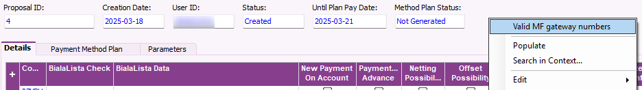
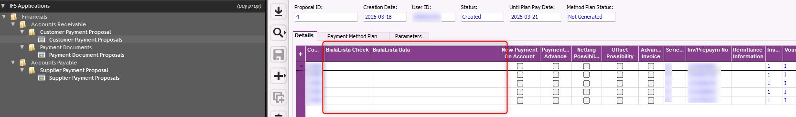
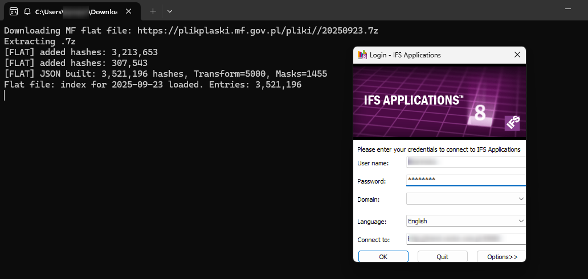
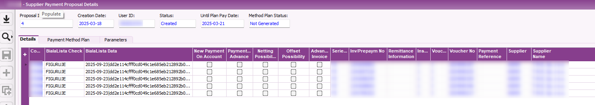

# IFS Whitelist Integration (MF Flat File)

This repository contains a C# utility that integrates **IFS Applications** with the **Polish Ministry of Finance (MF) "white list of VAT taxpayers"** flat file.  
The solution automates compliance checks for outgoing payments in **Customer Payment Proposals**.

---

## 📖 Overview

1. **Custom fields in IFS**  
   Two new Custom Fields were added to the header of *Customer Payment Proposals*:
   - `CF$_BIALALISTAODP` → Status: `FIGURUJE` / `NIE FIGURUJE`  
   - `CF$_BIALALISTADATA` → Date of check + MF hash used  

2. **Context menu action**  
   A right-click menu was added on the proposal header, which calls the external C# program with parameters:
   Program.exe <environment> <company> <proposal_id>
   - `environment` → `prod` / `test` / `demo` (predefined mapping)  
- `company` → IFS Company ID (string, max 20 chars)  
- `proposal_id` → Proposal numeric ID  

3. **External program (C#)**  
- Downloads today’s flat file from MF (`plikplaski.mf.gov.pl`)  
- Extracts `.7z`, parses JSON, builds index of hashes + masks  
- Verifies each line in the proposal for **suppliers with country = POLAND**  
- Generates MF hash (`SHA-512` with N iterations, optional account masks)  
- Writes results back to IFS via `Cf_Modify__`  

4. **Lifecycle**  
- Program always requires IFS credentials (login dialog)  
- Old flat files are automatically removed (cache is daily)  
- On exit, IFS session is closed gracefully

---

## 🖼 Screenshots

### Custom context menu in IFS


### Custom fields (empty state)


### External C# software console


### Custom fields (after check, filled with result)


---

## ⚙️ Technical details

- **Technology**:  
- .NET Framework 4.7.2 / 4.8, C# 7.3  
- Libraries: `Ifs.Fnd.*`, `System.Windows.Forms`, `System.Web.Extensions` (JSON), optional `SharpCompress` (NuGet)  
- External dependency: `7z.exe` (fallback if no SharpCompress)  

- **Business logic**:  
- For each supplier (POLAND):  
 - Build input string = `YYYYMMDD + NIP [+ NRB or masked NRB]`  
 - Apply SHA-512 hash with `FlatTransformCount` iterations (e.g., 5000)  
 - Compare hash against MF’s whitelist indices  
- Update IFS proposal header via PL/SQL API:  
 ```sql
 CF$_BIALALISTADATA = '2025-09-22|<hash>'
 CF$_BIALALISTAODP  = 'FIGURUJE' or 'NIE FIGURUJE'
 ```
 followed by `COMMIT`.

- **Security & Compliance**:  
- Payments to accounts not on the whitelist may not be tax-deductible  
- Potential **joint VAT liability** (with exceptions like MPP, ZAW-NR)  
- The stored hash is a cryptographic proof of the MF check at execution time  

---

## 🚀 Usage

1. Open *Customer Payment Proposal* in IFS  
2. Right-click the header → **Check MF Whitelist**  
3. Enter IFS credentials (required each run)  
4. Program runs checks for all proposal lines and updates the custom fields  
5. Review results in IFS (green = `FIGURUJE`, red = `NIE FIGURUJE`)

---

## 🧹 Housekeeping

- The program automatically deletes old cache folders (`mf_flat_cache/YYYYMMDD`)  
- Only today’s index is preserved  
- Ensures always up-to-date whitelist data  

---

## 📌 Parameters
Program.exe <environment> <company> <proposal_id>

- **environment** → must be one of `prod`, `test`, `demo`  
- **company** → company code (string, up to 20 chars)  
- **proposal_id** → proposal ID (integer)

Example:
Program.exe prod 07VBH 4


---

## 📈 Financial context

- Polish law requires that payments to suppliers are made only to bank accounts listed on the official **white list of VAT taxpayers**.  
- Failure to comply may result in:
  - Loss of tax deductibility for the expense  
  - Joint VAT liability with the supplier  
- By embedding the check directly into the **payment proposal process**, Finance teams gain:
  - Automated compliance before payments are released  
  - An auditable record of checks (date + MF hash)  
  - Simplified internal & external audit procedures  

---

## 🏷 License

Feel free to use :)


