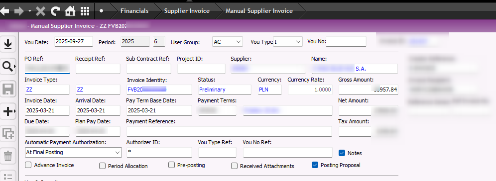
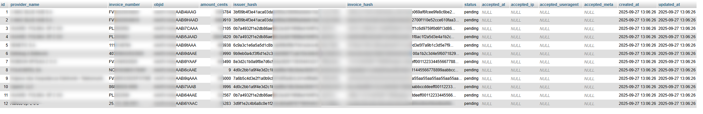
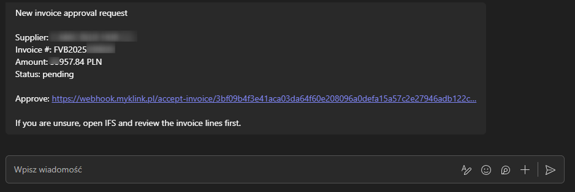
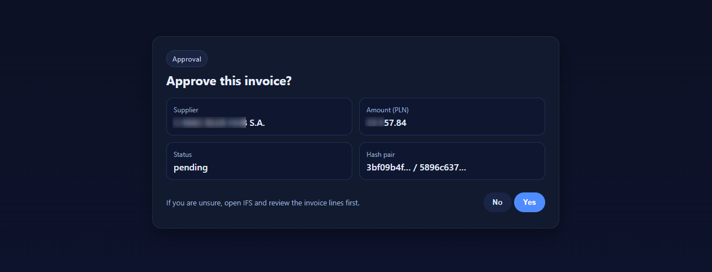
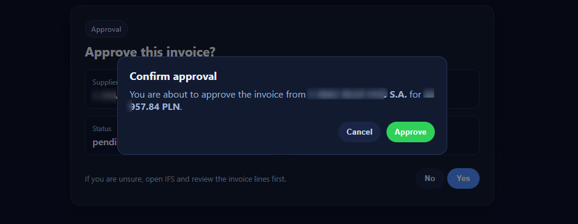
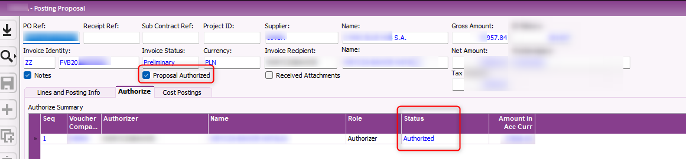

# Invoice Approval – IFS → Webhook → Teams (Overview)

A lightweight approval flow for supplier invoices.

**Flow**
1. An invoice is entered in **IFS** (with an authorizer).
2. IFS (or an integration job) sends the invoice header to a public **webhook API**.
3. The webhook returns **approval** and **status** URLs.
4. The approver receives a **Teams** message with the approval link.
5. The approval page shows supplier, amount, and current status.
6. After clicking **Approve**, a confirmation modal appears.
7. IFS consumes the event/status and authorizes the invoice.

---

## Screenshots

| Step | Screenshot |
|------|------------|
| 1. Add invoice in IFS |  |
| 2. Add posting/authorizer |  |
| 3. Webhook DB (tech view) |  |
| 4. Teams notification |  |
| 5a. Approval page |  |
| 5b. Confirmation modal |  |
| 6. Authorized in IFS |  |

> Tip: keep hashes partially masked in screenshots (e.g., show first 6–8 chars only).

---

## Public endpoints (interface only)

- **Add invoice (ERP → Webhook)**  
  `POST /api/invoice` with HMAC headers (`X-Timestamp`, `X-Nonce`, `X-Signature`).

  **Body (example with placeholders):**
  ```json
  {
    "provider_name": "<SUPPLIER_NAME>",
    "invoice_number": "<INVOICE_NO>",
    "objid": "<IFS_OBJID>",
    "amount": "<AMOUNT_1234_56>",
    "issuer": "<AUTHORISER_CODE>"
  }
  ```
  **Response:**
  ```json
  {
    "ok": true,
    "accept_url": "https://<host>/accept-invoice/<issuer_hash>/<invoice_hash>"
  }
  ```

- **Approve invoice (user action)**  
  `GET /accept-invoice/{issuer_hash}/{invoice_hash}` → page with confirmation modal  
  `POST /accept-invoice/{issuer_hash}/{invoice_hash}` → records decision

- **Status (read-only)**  
  `GET /status-invoice/{issuer_hash}/{invoice_hash}` → JSON like:
  ```json
  {
    "provider_name": "<SUPPLIER_NAME>",
    "invoice_number": "<INVOICE_NO>",
    "objid": "<IFS_OBJID>",
    "amount": "<AMOUNT_1234_56>",
    "currency": "PLN",
    "status": "pending|accepted",
    "accepted_at": null,
    "created_at": "YYYY-MM-DD HH:MM:SS",
    "updated_at": "YYYY-MM-DD HH:MM:SS"
  }
  ```

---

## Hashing & privacy

- `issuer_hash = HMAC-SHA256(<AUTHORISER_CODE>, API_SHARED_SECRET)`  
- `invoice_hash = HMAC-SHA256(<IFS_OBJID>, API_SHARED_SECRET)`  

---

## Teams message (paste-ready template)

```
🧾 **Invoice approval request**


---

## Security notes (non-sensitive)

- CSRF on approval POST.
- No restricted data in URLs; hashes only.
- Optional per-IP and per-invoice rate limiting.
- Strict headers & CSP on the approval page.

---
